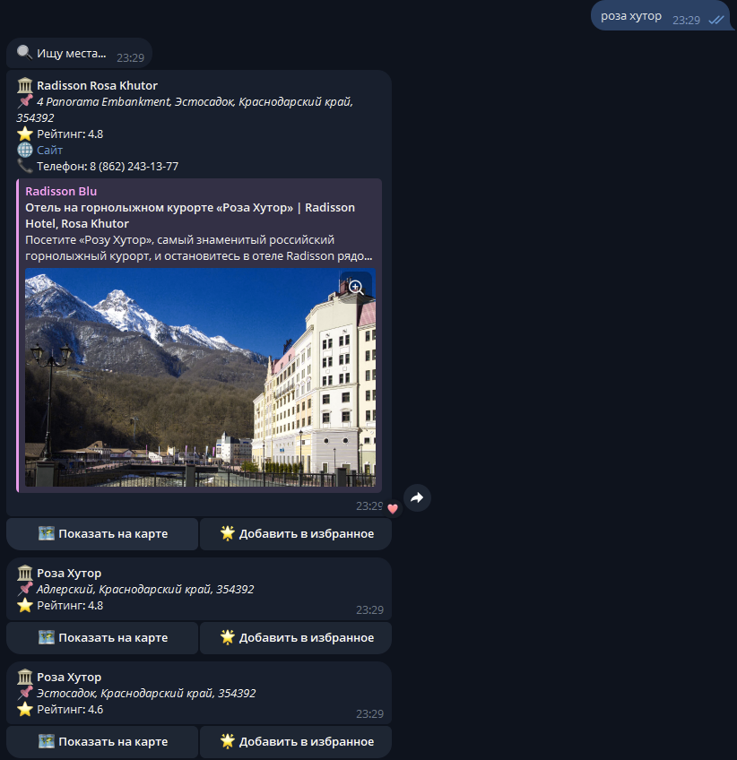

# City Expert Bot 🌍

Telegram-бот для поиска достопримечательностей, отелей и мест отдыха в России и мире

## 🔹 Возможности бота

✅ Поиск мест по названию или категориям  
✅ Фильтрация по рейтингу и местоположению  
✅ Просмотр адреса, телефона, сайта  
✅ Кнопка "Показать на карте"  
✅ Добавление в избранное (`/favorites`)  
✅ История поиска (`/history`)  

## 🔸 Используемые API

### 1. Google Maps Places API (через RapidAPI)
**Базовый URL**: `https://google-map-places-new-v2.p.rapidapi.com`  
**Требуемые заголовки**:
```http
X-RapidAPI-Key: ваш_ключ
X-RapidAPI-Host: google-map-places-new-v2.p.rapidapi.com
Content-Type: application/json
```

## Пример запроса поиска мест:

```
POST /v1/places:searchText
```

## Тело запроса:

```
{
  "textQuery": "отели Сочи",
  "languageCode": "ru",
  "regionCode": "RU",
  "locationBias": {
    "circle": {
      "center": {
        "latitude": 43.5855,
        "longitude": 39.7231
      },
      "radius": 5000
    }
  }
}
```

## Пример ответа:

```
{
  "places": [
    {
      "name": "places/123456",
      "id": "123456",
      "displayName": {
        "text": "Radisson Rosa Khutor",
        "languageCode": "ru"
      },
      "formattedAddress": "ул. Олимпийская, 35, Эстосадок",
      "location": {
        "latitude": 43.6575,
        "longitude": 40.3139
      },
      "rating": 4.7,
      "websiteUri": "https://www.radissonhotels.com",
      "nationalPhoneNumber": "+7 862 123-45-67",
      "currentOpeningHours": {
        "openNow": true,
        "periods": [
          {
            "open": {"day": "MONDAY", "time": "0800"},
            "close": {"day": "MONDAY", "time": "2200"}
          }
        ]
      },
      "photos": [
        {"name": "photos/123456"}
      ]
    }
  ]
}
```

## 📋 Команды бота
### Основные команды
**/start** - Начало работы с ботом

**/help** - Справка по всем командам

### Поисковые команды
🔍 Поиск достопримечательностей

Отправляет текстовый запрос в Google Maps Places API

### Пример запроса API:

```
await api.search("достопримечательности Сочи")
```

### 📍 Рядом со мной
Использует геолокацию пользователя для поиска

Пример запроса API:

```
await api.search("кафе", latitude=43.5855, longitude=39.7231)
```

### 📖 История поиска (/history)

Показывает последние 10 запросов из базы данных

Пример ответа:

```
🔍 Поиск: "отели Сочи"
🕒 2024-05-06 14:30
```

### ⭐ Избранное (/favorites)

Показывает сохраненные места

Пример ответа:

```commandline
🏛 Radisson Rosa Khutor
📅 Добавлено: 06.05.2024
```

# 🛠 Установка и запуск
## Требования
Python 3.10+

API ключи:

Telegram Bot Token (от @BotFather)

RapidAPI Key (для Google Maps Places API)

### Инструкция
1. Клонируйте репозиторий:

```commandline
git clone https://gitlab.skillbox.ru/bogdan_rengo/python_basic_diploma.git
cd python_basic_diploma
```

2. Установите зависимости:

```commandline
pip install -r requirements.txt
```

3. Настройте окружение:
### Создайте ```.env``` файл:

```commandline
TELEGRAM_BOT_TOKEN=ваш_токен
RAPIDAPI_KEY=ваш_ключ
DATABASE_URL=sqlite:///data/city_expert.db
DEBUG=False
LOG_LEVEL=INFO
```

4. Инициализируйте БД:

```
bash
python create_tables.py
```

5. Запустите бота:

```
bash
python city_expert/main.py
```

# 📄 Технические детали
- API: Google Maps Places (через RapidAPI)

- База данных: SQLite (Peewee ORM)

- Логирование: Loguru (файлы в папке logs/)

- Архитектура: MVC-подобная структура

### Пример работы бота:
